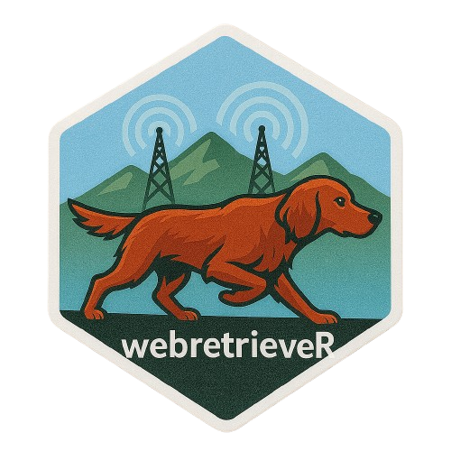

# webretrieveR 

**webretrieveR** is a lightweight R package for retrieving external context (from search engines) and passing it into LLM workflows (e.g. via [`ellmer`](https://github.com/dirkschumacher/ellmer)).  

It currently supports:

- **DuckDuckGo** – Instant Answer API with fallback to web search  
- **Wikipedia** – direct article summaries  

The retrieved snippets are returned as plain text “contexts” you can directly feed into a model.

---

## ✨ Features
- Unified interface: `wr_retrieve(query, engines = ...)`  
- Multiple engines at once (concatenated into a single context)  
- Smart DuckDuckGo retriever:
  - Instant Answer API (for definitions, package docs, facts)  
  - Falls back to web search snippets if IA has no results  
- Designed for chaining into LLM chat clients like **ellmer**  

---

## 🔧 Installation
```r
# Install dev version
devtools::install_github("your-org/webretrieveR")
```

---

## 🚀 Usage

### List Engines
```r
devtools::load_all()
webretrieveR::wr_list_engines()
#> [1] "ddg" "wikipedia"
```

### Smoke Test
```r
cat(webretrieveR::wr_retrieve("R programming language", engines = "ddg"), "\n\n")
cat(webretrieveR::wr_retrieve("R programming language", engines = "wikipedia"), "\n\n")
```

### Combine Engines
```r
ctx <- webretrieveR::wr_retrieve("Posit Workbench", engines = c("ddg","wikipedia"))
cat(substr(ctx, 1, 800))  # preview first 800 chars
```

---

## 🤝 Passing Context to LLMs

You can pipe retrieved context into [`ellmer`](https://github.com/dirkschumacher/ellmer) for question answering:

```r
library(ellmer)

# Retrieve context (DuckDuckGo example)
context <- webretrieveR::wr_retrieve("R Package Tidymodels", engines = "ddg")
print(context)

# Create an ellmer client
chat <- ellmer::chat_aws_bedrock(
  model = "anthropic.claude-3-5-sonnet-20240620-v1:0"
)

# Ask a question using retrieved context
response <- chat$chat(paste0(
  "Use the following context when answering:\n\n",
  context, "\n\n",
  "Question: Tell me about tidymodels"
))

cat(response)
```

### Example Output
```
Tidymodels is a meta-package for R that focuses on modeling and machine learning tasks.
Here are some key points:

1. It's designed to be a comprehensive collection of packages for data modeling and ML.
2. As a meta-package, tidymodels installs and loads core packages for workflows.
3. It follows tidyverse principles for consistency and usability.
...
```

---

## 📦 Example Context from DuckDuckGo
```
Source: DuckDuckGo
Query: R Package Tidymodels
- Tidymodels packages – tidymodels is a meta-package that installs and loads core packages...
- Help for package tidymodels - The Comprehensive R Archive Network – conflicted package is used to manage precedence...
```

---

## 🗺️ Roadmap
- Add more engines (Brave, Bing, PubMed, arXiv, CRAN, etc.)  
- HTML cleaning for snippets/links  
- Better structured context blocks (Title + Snippet + URL triples)  

---

## ⚖️ License
MIT © 2025  
